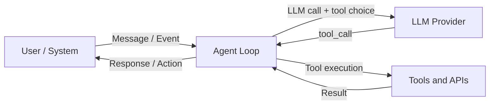
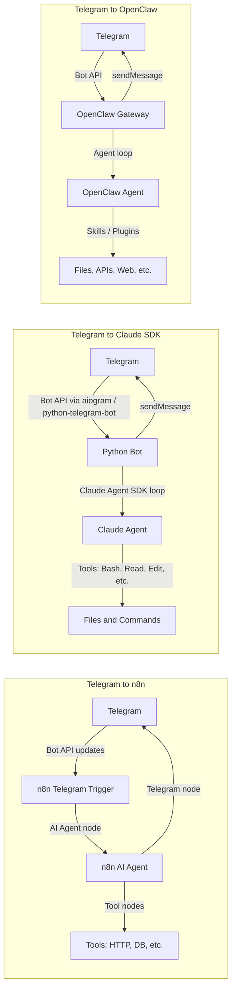

Here’s a structured “deep dive” view that should give you a solid mental model and then directly answer your Telegram scenario.

---

## 1. What is an “AI agent” (the shared core)

Across all three systems you mentioned, an **AI agent** is basically:

> A piece of software that:
> - receives messages or events,
> - decides what to do next using an LLM (often with tools),
> - then actually does things: call APIs, read/write files, run workflows, etc.

n8n’s own docs put it this way: an AI agent is an *“autonomous system that receives data, makes rational decisions, and acts within its environment to achieve specific goals. This agent uses external tools and APIs to perform actions and retrieve information.”*【turn10fetch0】

So in all three cases you’re looking at roughly this loop:



That loop is the same whether it’s:

- Claude Code / Agent SDK in a Python app,
- n8n’s AI Agent node in a workflow,
- or OpenClaw running on your laptop.

---

## 2. The three “species” of agents you care about

### 2.1 Claude “team agents” (Claude Code / Agent SDK / Agent Teams)

**What they are**

- **Claude Code** is a terminal/IDE-based AI dev agent that can read/write files, run commands, edit code, etc.【turn16fetch0】
- The **Claude Agent SDK** (formerly Claude Code SDK) lets you build the same kind of agent programmatically, with the *same tools, agent loop, and context management* that power Claude Code【turn16fetch0】.
- **Agent Teams** let you coordinate multiple Claude Code sessions as a “team”: one lead, multiple teammates, a shared task list, and a mailbox for agent-to-agent messaging【turn18fetch0】.

**Key characteristics**

- **Environment**: your local machine or a server; strong focus on **code and dev workflows**.
- **Tools**: built-in tools like `Read`, `Write`, `Edit`, `Bash`, `Glob`, `Grep`, `WebSearch`, `WebFetch`, `AskUserQuestion`【turn16fetch0】.
- **Tool execution**: the SDK (or Claude Code) actually executes these tools on your machine.
- **Context management**: sessions, memory, and project-level config (`CLAUDE.md`, `.claude/skills`, `.claude/commands`)【turn16fetch0】.
- **Multi-agent**: Agent Teams formalize multi-agent coordination with roles, shared tasks, and messaging【turn18fetch0】.
- **Interface**: primarily CLI/IDE; no built-in Telegram client. If you want Telegram, you build it.

**When you use it**

- You want a **code-focused agent** that can deeply integrate with your repo, run tests, git, etc.
- You’re OK writing and operating a **custom app** around it.

---

### 2.2 n8n agents

**What they are**

- n8n is a **workflow automation tool** with nodes for many apps (Telegram, HTTP, DBs, etc.).
- The **AI Agent node** is a special node that embeds an LLM-powered agent into your workflow. n8n defines it as an autonomous system that uses tools and APIs to decide and act【turn10fetch0】.
- n8n has strong Telegram support:
  - **Telegram Trigger node** – fires on new messages, edits, reactions, etc.【turn24fetch0】
  - **Telegram node** – send messages, edit, get chat info, etc.【turn2search6】

**Key characteristics**

- **Environment**: n8n server (self-hosted or cloud).
- **Tools**: tools are implemented as **other nodes** (HTTP Request, Google Sheets, Slack, etc.) or custom code nodes.
- **Tool execution**: n8n executes the workflow; each tool call is a node execution.
- **Context management**: workflows can maintain state (databases, KV stores, expressions), but no out-of-the-box long-lived “memory” like Claude Code.
- **Multi-agent**: you can design multi-agent patterns with sub-workflows and “gatekeeper” agents, as described in n8n’s AI agentic workflows guide【turn20fetch0】.
- **Interface**: web UI editor; agents are just workflows that can be triggered by Telegram, webhooks, schedule, etc.

**When you use it**

- You want **low-code visual workflow automation**.
- You want Telegram + 400+ integrations, and you’re OK with less deep code-level access than Claude Code/OpenClaw.

---

### 2.3 OpenClaw

**What it is**

- OpenClaw is an **open-source personal AI assistant** that runs on your own machine and talks to you via chat apps like Telegram, WhatsApp, Discord, Slack, Signal, iMessage, etc.【turn19fetch0】【turn19fetch1】
- It’s explicitly an **open agent platform**: “runs on your machine and works from the chat apps you already use”【turn19fetch1】.
- It can control the machine it runs on: read/write files, run shell commands, browse the web, use plugins/skills, and has persistent memory【turn19fetch0】.

**Key characteristics**

- **Environment**: your machine (Mac, Windows, Linux, VPS, homelab).
- **Tools**: local tools (files, shell), web browsing, plus many plugins/integrations (Gmail, GitHub, Obsidian, etc.)【turn19fetch0】.
- **Tool execution**: the agent executes tools directly on your machine.
- **Context management**: persistent memory across chats; supports “skills” and plugins that extend capabilities【turn19fetch0】.
- **Multi-agent**: you can run multiple instances and there are projects like ClawWork that use OpenClaw as an AI coworker for multi-professional work【turn31fetch0】.
- **Interface**: chat apps; **Telegram is a first-class channel** with long-polling/webhook modes, group support, streaming replies, etc.【turn21fetch0】.

**When you use it**

- You want a **personal AI coworker** that lives in Telegram/WhatsApp and can act on your machine and your accounts.
- You’re OK operating a self-hosted agent and dealing with its security implications【turn31fetch1】.

---

## 3. What they have in common

Conceptually, they all share the same core architecture:

| Aspect | Common pattern |
|--------|----------------|
| Core loop | LLM decides which tool(s) to call, tools execute, results feed back into next LLM call. |
| Tools | Functions that wrap APIs, files, shell commands, or other services. |
| Context | Conversation history + some memory / project context. |
| Triggers | Webhooks, chat messages, schedules, etc. start the agent. |
| Hosting | You run the agent loop on your own infrastructure (laptop, server, cloud). |

All three also rely on:

- **Tool calling / function calling** to let the model “act”.
- Some **state management** (session, DB, or in-memory).
- Some **security model** (permissions, sandboxes, allowlists).

---

## 4. Key differences (high-level)

### 4.1 Positioning & “shape”

| Aspect | Claude Code / Agent SDK | n8n agents | OpenClaw |
|--------|-------------------------|-----------|----------|
| Primary role | Code & dev agent; SDK for building custom agents | Visual workflow automation with AI nodes | Personal AI assistant that lives in chat apps |
| Primary interface | CLI / IDE / your own UI | n8n web editor | Telegram, WhatsApp, Discord, Slack, etc. |
| Target user | Developers building custom agents | Devs & no-cods building workflows | Power users wanting a personal assistant |
| Tools focus | Code tools: files, git, bash, grep, web search | Business tools: SaaS apps, DBs, HTTP, email | Everything: files, shell, web, plugins, skills |

### 4.2 Capabilities & trade-offs

| Aspect | Claude Code / Agent SDK | n8n agents | OpenClaw |
|--------|-------------------------|-----------|----------|
| Code-level access | Very strong; can read/write your repo, run tests, edit code【turn16fetch0】 | Limited; you can run commands, but n8n is not a dev environment | Strong; can run arbitrary commands on the host【turn19fetch0】 |
| Chat integrations | None built-in; you implement Telegram yourself | Strong built-in Telegram support (Trigger + Send nodes)【turn24fetch0】【turn2search6】 | Telegram is a first-class channel【turn21fetch0】 |
| Observability | You build logging/monitoring | Built-in execution history, logs, and UI observability | Logs and CLI, but you build monitoring dashboards yourself |
| Security | You design auth, permissions, sandboxing | n8n’s permissions model + external secrets; decent built-in security | Very powerful; but has attracted security criticism due to broad access【turn31fetch1】 |
| Extensibility | SDK + custom tools + MCP | Nodes + code nodes + MCP client【turn33fetch0】 | Plugins/skills; can even write its own skills【turn19fetch0】 |

---

## 5. Telegram scenario: three different architectures

Now the specific scenario you asked for:

> Telegram → n8n,  
> Telegram → Claude SDK Python app,  
> Telegram → OpenClaw.

### 5.1 Big picture

Here’s a side-by-side architecture view:



---

### 5.2 Telegram → n8n

**How it works**

1. **Telegram side**
   - You create a bot via `@BotFather`, get a token.
   - In n8n, you configure **Telegram Trigger** with that token.
   - The Trigger can listen to many events: `message`, `edited_message`, `callback_query`, etc.【turn24fetch0】.

2. **n8n side**
   - The Telegram Trigger emits items containing message text, chat ID, user info, etc.
   - You feed those items into an **AI Agent node**, which:
     - Uses a connected LLM (e.g. Claude via Anthropic node, or OpenAI).
     - Has access to **tool nodes** (HTTP Request, Google Sheets, Slack, etc.)【turn10fetch0】.
   - The AI Agent decides which tools to call, and n8n executes them as part of the workflow.
   - Finally, you use the **Telegram node** to send replies back to the same chat【turn2search6】.

3. **Example: simple Telegram AI assistant in n8n**

   Rough workflow:

   - **Telegram Trigger (On Message)** → receives text.
   - **AI Agent node**:
     - System prompt: “You are a helpful assistant in Telegram.”
     - Tools:
       - `HTTP Request` to call an external API.
       - `Google Calendar` node to create events.
       - `Code` node for small Python scripts.
   - **Telegram node**:
     - Operation: `sendMessage`.
     - Chat ID: from trigger.
     - Text: last AI message.

   n8n’s docs show similar patterns using AI Agent nodes with Telegram【turn2search1】【turn2search2】.

**Pros**

- Very quick to build visually; no heavy coding.
- Built-in Telegram support, error handling, retries, execution history.
- Easy to swap models or change tools without touching code.

**Cons**

- Tools are **n8n nodes**, not arbitrary code on your machine.
- Less suitable for deep, open-ended “computer use” style tasks.
- Long-running agent loops are possible but less natural than in a code-first agent.

---

### 5.3 Telegram → Claude SDK Python app

**How it works**

1. **Telegram side**

   - You still create a Telegram bot and get a token.
   - You run a **Python process** that:
     - Uses a Telegram bot library (e.g. `python-telegram-bot` or `aiogram`)【turn2search9】【turn2search11】.
     - Polls Telegram Bot API or sets a webhook to your server.

2. **Python bot + Claude Agent SDK**

   - Your Python code:
     - Receives messages from Telegram.
     - Turns them into prompts for the Claude Agent SDK.
     - Runs the agent loop (often via `query()` or a custom loop).
   - The **Claude Agent SDK** provides:
     - Built-in tools: `Read`, `Edit`, `Bash`, `Glob`, `Grep`, `WebSearch`, `WebFetch`【turn16fetch0】.
     - A managed agent loop with sessions and context.
   - You can also add **custom tools** as Python functions.

3. **Example skeleton (Python)**

   Pseudo-code:

   ```python
   import asyncio
   from telegram import Update
   from telegram.ext import ApplicationBuilder, ContextTypes, MessageHandler, filters
   from claude_agent_sdk import query, ClaudeAgentOptions

   TELEGRAM_TOKEN = "your-bot-token"

   async def handle_message(update: Update, context: ContextTypes.DEFAULT_TYPE):
       text = update.message.text
       chat_id = update.effective_chat.id

       # Run Claude Agent SDK
       async for msg in query(
           prompt=text,
           options=ClaudeAgentOptions(
               allowed_tools=["Bash", "Read", "Write", "Edit"],
           ),
       ):
           if hasattr(msg, "result"):
               # Send reply back to Telegram
               await context.bot.send_message(chat_id=chat_id, text=msg.result)

   async def main():
       app = ApplicationBuilder().token(TELEGRAM_TOKEN).build()
       app.add_handler(MessageHandler(filters.TEXT & ~filters.COMMAND, handle_message))
       await app.run_polling()

   if __name__ == "__main__":
       asyncio.run(main())
   ```

   This is essentially what projects like `claude-code-telegram` do: they wrap Claude Code/Agent SDK and expose it via Telegram【turn30fetch0】.

**Pros**

- Full control over:
  - How messages are turned into prompts.
  - Which tools are exposed.
  - How sessions and memory are managed.
- You can integrate with **any Python library or internal service**.
- Good fit for **code-heavy agents** that need deep access to a codebase.

**Cons**

- You must build and operate the Telegram integration yourself:
  - Bot framework, webhooks or polling, error handling, logging.
- You must implement:
  - Auth, rate limiting, abuse protection.
  - Observability (logs, metrics, tracing).
- More engineering work than n8n or OpenClaw.

---

### 5.4 Telegram → OpenClaw

**How it works**

1. **Telegram side**

   - You create a Telegram bot and enable it as an OpenClaw channel.
   - OpenClaw’s **Telegram channel** uses the Bot API and supports:
     - Long polling by default (webhook optional)【turn21fetch0】.
     - DMs and group chats.
     - Mention handling, inline buttons, streaming replies, etc.【turn21fetch0】.

2. **OpenClaw side**

   - OpenClaw runs as a **gateway + agent** on your machine.
   - It:
     - Receives Telegram messages via the configured channel.
     - Builds a prompt and context (including memory, skills).
     - Calls an LLM (Claude, OpenAI, local models, etc.).
     - Uses **skills/plugins** to execute actions: read/write files, call APIs, send emails, control devices, etc.【turn19fetch0】.
   - Replies are sent back to the same Telegram chat or user.

3. **Configuration snippet**

   From OpenClaw’s Telegram docs【turn21fetch0】:

   ```jsonc
   {
     "channels": {
       "telegram": {
         "groups": {
           "-1001234567890": {
             "groupPolicy": "open",
             "requireMention": false,
           },
         },
       },
     },
   }
   ```

   And runtime behavior:

   - Telegram is owned by the gateway process.
   - Inbound messages are normalized into a shared envelope.
   - Group sessions are isolated by group ID; topics are isolated via `:topic:<threadId>`【turn21fetch0】.

**Pros**

- Very fast to get a **Telegram-native personal agent**.
- No need to implement Telegram logic or agent loop yourself.
- Built-in memory, skills, and many integrations out of the box【turn19fetch0】.
- Supports multi-modal use (images, files) via Telegram.

**Cons**

- You’re adopting a **full self-hosted agent** with broad access to your machine and accounts.
- Security model is powerful but also a big responsibility【turn31fetch1】.
- Less “low-code” visual workflow than n8n; more “install and configure” YAML/JSON.

---

## 6. Direct comparison: Telegram scenarios

### 6.1 Side-by-side summary

| Aspect | Telegram → n8n | Telegram → Claude SDK app | Telegram → OpenClaw |
|--------|----------------|---------------------------|---------------------|
| Who owns Telegram integration? | n8n (Telegram Trigger + nodes) | You (Python bot library) | OpenClaw (Telegram channel) |
| Where is the agent loop? | n8n AI Agent node in a workflow | Your Python process using Claude Agent SDK | OpenClaw gateway/agent process |
| Where do tools run? | n8n server (cloud or self-hosted) | Your Python app’s environment | The machine OpenClaw runs on |
| Main use case | Telegram bot that automates business workflows | Code-heavy agent, custom logic, deep integrations | Personal AI assistant that lives in Telegram and acts on your machine |
| Setup effort | Medium (design workflow in UI) | High (write and operate bot) | Medium (install and configure OpenClaw) |
| Flexibility | Moderate (nodes + code nodes) | High (any Python code + Agent SDK tools) | High (skills + plugins; but within OpenClaw’s framework) |
| Observability | Built-in execution history | You build logging/monitoring | Logs + metrics; you build dashboards |

### 6.2 When to choose which

- **Choose Telegram → n8n** if:
  - You want a **no-code/low-code** Telegram bot.
  - You need integrations with SaaS tools (Google Sheets, Slack, Jira, etc.).
  - You’re fine with tools being n8n nodes, not arbitrary code on your laptop.

- **Choose Telegram → Claude SDK Python app** if:
  - You’re a developer building a **custom agent** with special requirements.
  - You want deep integration with your codebase, internal APIs, or existing systems.
  - You’re OK owning Telegram integration, infra, and observability.

- **Choose Telegram → OpenClaw** if:
  - You want a **ready-made personal assistant** that lives in Telegram.
  - You want it to act on your behalf (email, calendar, files, devices) without building everything from scratch.
  - You’re comfortable self-hosting and managing a powerful agent.

---

## 7. How to “master” these agents

To really get fluent, I’d recommend this progression:

1. **Understand the core loop**  
   - Implement a minimal “agentic loop” yourself:  
     - Receive a message → call Claude/OpenAI with tools → execute tool → reply.  
   - This is what the Claude Agent SDK, n8n’s AI Agent node, and OpenClaw all do internally.

2. **Build a tiny Telegram agent with Claude SDK**
   - Start from the skeleton code above.
   - Add one tool (e.g. “run a shell command” or “read a file”).
   - Add logging and simple per-user rate limiting.

3. **Recreate the same agent in n8n**
   - Use Telegram Trigger → AI Agent node → Telegram node.
   - Implement the same tool as an HTTP Request or Code node.
   - Compare the two in terms of development speed, observability, and flexibility.

4. **Finally, try OpenClaw**
   - Install it locally, configure the Telegram channel.
   - Add a simple skill (e.g. a script that calls an API).
   - Compare how much “plumbing” you get for free versus the DIY approach.

Once you’ve done those three implementations, the differences will be very concrete, and you’ll have a clear mental model for any future AI agent platform.